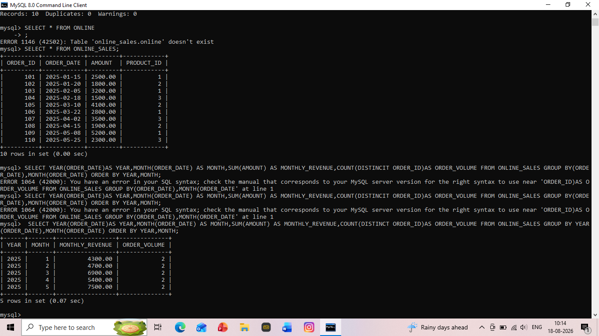
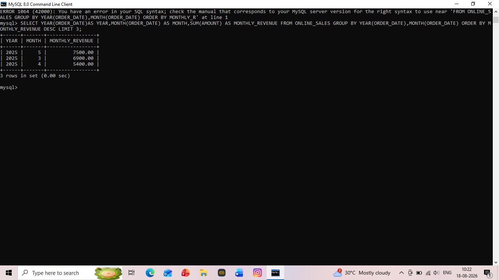

# TASK 6: Sales Trend Analysis Using Aggregations

## Objective
Analyze monthly revenue and order volume from ONLINE_SALES dataset

## Tools Used
MySQL 8.0

## Key Findings
- Data Period: Jan 2025 to May 2025
- Highest Revenue: May 2025 - 7500.00
- Top 3 Months: May, March, April 2025

## Results

